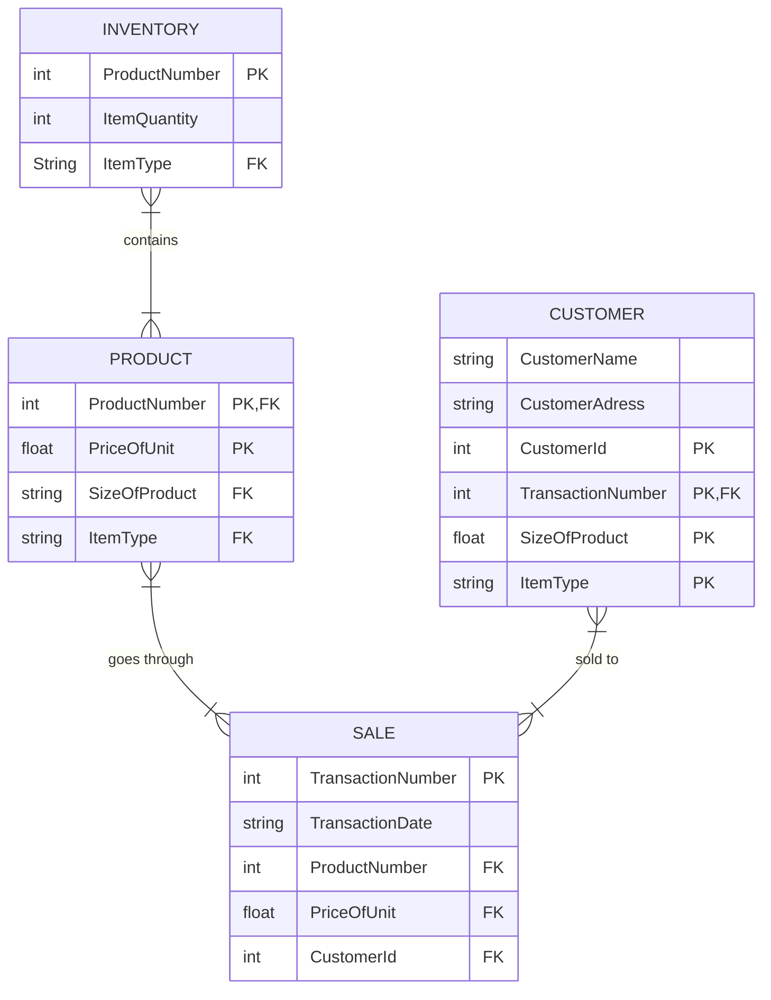

##### INVENTORY
- It contains the companies different types of products and keeps track of item quantities.
- Very important step as it shows and provides the company, the employee and customer of what item is instock and avaliable for purchasing 
##### Product
- It contains its own product number and has a certin price varying on the items as well as has limited sizes.
- This step is important because it provides the products information such as the type of product, the size of the prodcut and price of the product. 
##### Sale 
- The purchase of the item being requested, involves the product, creating a transaction date and number, and useage of a customer id.
- This is one of the most important steps in the process as it has the final transaction of the product. This is where a transaction id, date and a customer id is created in exchange for a profit from the product.
##### Customer
- Customer's request to purchase the item while providing information such as their full name, adress, size of product,type of product and a customer id that has been created.
- This step is crucial because in order for the any of the steps to go through the customer has to be able to know the type of product they need, the size and have their information and funds needed to complete the entire cycle.
##### Conclusion
- All steps of the process are crucial and needed for a comany to be able to have a proper sales cycle from inventory to customer. It also shows the type of information needed in order for each one to proceed on to the next step.
